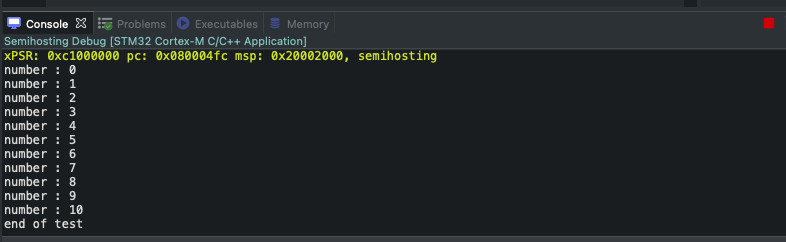

# Semihosting in STM32 (STM32CubeIDE)


## #1 : In Project Properties, select C/C++ Build, then Settings , then Add to Miscellaneous 

NOTE: Do not Forget to enable Serial Debug in StmCube

```
-specs=rdimon.specs -lc -lrdimon
```
<p align="center">

</p>


## #2 : Exclude syscall.c file by clicking  Right Click , then  Resource Configuration , select exclude from build  

<p align="center">

</p>

## #3 : Select Debug & Release  , then OK


<p align="center">

</p>

## #4 : Add Function Prototype out of the main Function 

```c
extern void initialise_monitor_handles(void);
```

<p align="center">

</p>


## #5 : Add The Following Function Call inside main. 

```c
initialise_monitor_handles();
```

<p align="center">

</p>

## #6 : In Debug Configurations select Startup Tab , the Add This Configuration Line .

```c
monitor arm semihosting enable
```

<p align="center">

</p>

<p align="center">

</p>

# Example & Result
```c
  /* Initialize all configured peripherals */
  MX_GPIO_Init();
  /* USER CODE BEGIN 2 */
  initialise_monitor_handles();
  static uint32_t myNum = 0;

  /* USER CODE END 2 */

  /* Infinite loop */
  /* USER CODE BEGIN WHILE */
  while (1)
  {
    /* USER CODE END WHILE */
      printf("number : %ld \n",myNum++);
      HAL_Delay(500);

      //test condition
      if(myNum > 10){
          printf("end of test \n");
          break;
      }
    /* USER CODE BEGIN 3 */
  }
```
### Result 

<p align="center">

</p>
